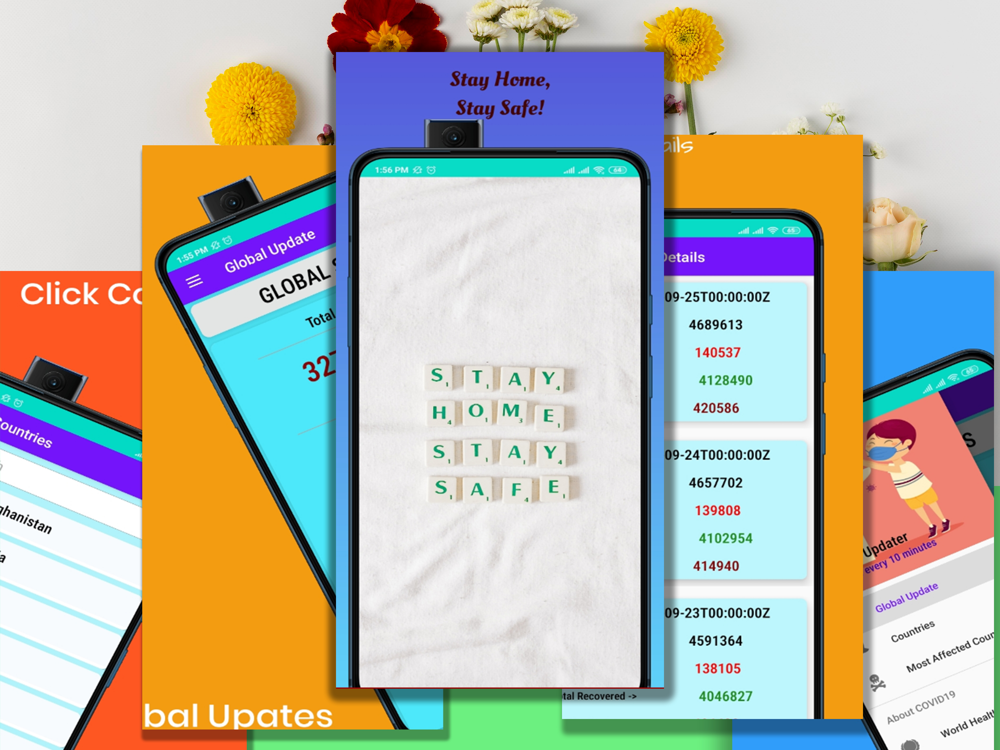
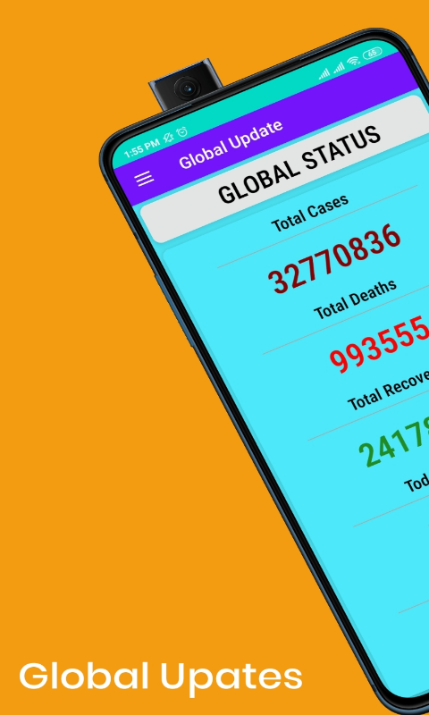
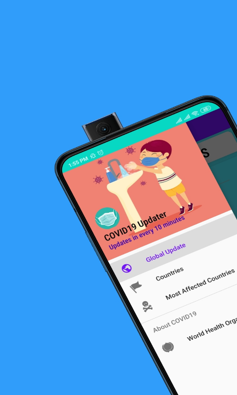
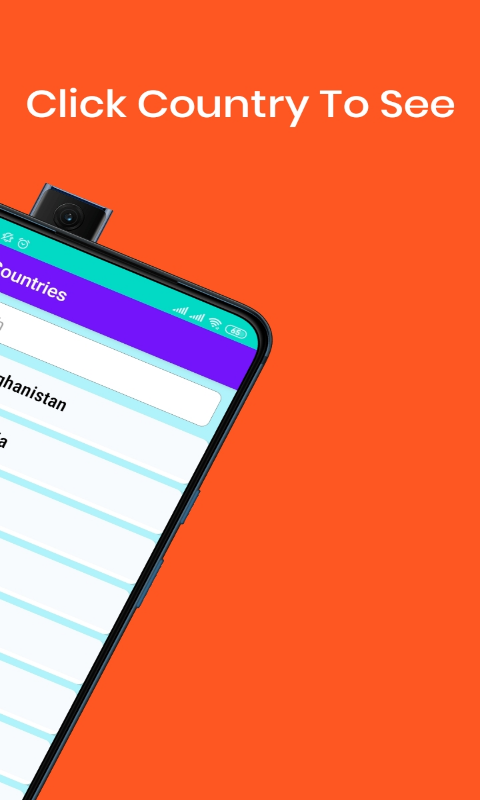
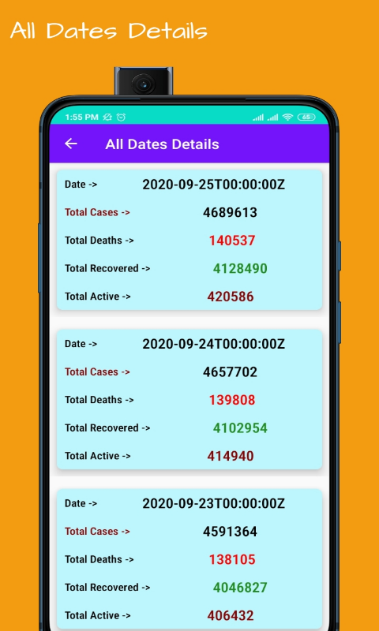
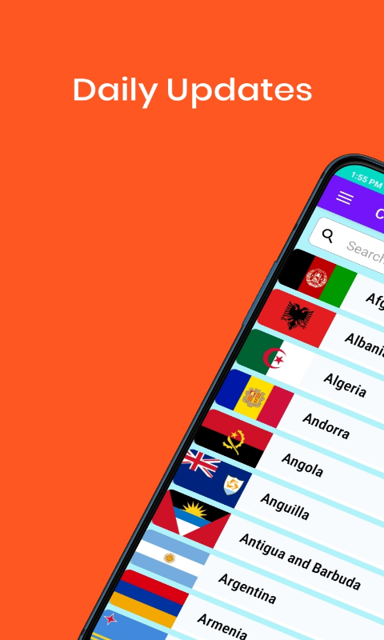

# Covid19Updates
A very simple app to track all the updates of corona virus. Its a project for increasing my learnign scope in Android App Development.

## Screenshots

Here are some screenshots of the Covid19 Updates:
<div align="center">
  
  
  
  
  
  
  
  
</div>

## Installation

Clone the repository:

```bash
git clone https://github.com/rifaturrana/SimpleBatBall
```
## Product features   
                                        
- COVID19 Tracker
• COVID19 Updates
• Free app
• Coronavirus
• World Health Organisation

## Product description
-COVID19 is the most dangerous virus all around the world. Everybody has to be carefu. So everyone needs to know the latest update of covid19. In this app anyonee can know the Global updates as well as all countries daily updates. I also put the most affected countries list and its all details from the beginning of this virus.
- Updates in every 10minutes
-Been provided WHO website for more information.


 ## License

This package is open source and available under the MIT License. Feel free to use it in your projects, modify it, and redistribute it as needed.

## Contributing

Contributions are welcome! If you would like to contribute to this project, please read the CONTRIBUTING file for more information.

## Issues

If you find a bug or have a feature request, please create an issue on the issue tracker.


## Support

If you need help or have questions about Secure-pass-generator, please contact me at smrifaturrana@gmail.com.
